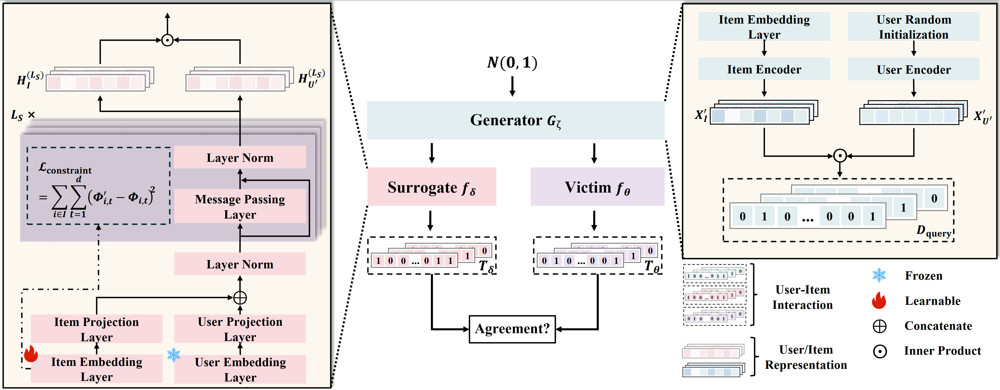

# Data-Free Model Extraction for Black-box Recommender Systems via Graph Convolutions

Implementation of the paper "Data-Free Model Extraction for Black-box Recommender Systems via Graph Convolutions".

## Approch




## Usage

### Train the victim model

```python
python benign_training.py --dataset ml-1m --model_name lgn --epoch 1000 --lr_benign 1e-3  --gpu 0 --seed 0
```

### Model Extraction

```python
python DBGRME.py --dump_path 'Log-Gen' --dataset ml-100k --victim_model lgn --query_budget 200000 --iter_clone 4 --gpu 0 --seed 0 --gen_top_k 1 --num_fakers 300 --lr_clone 1e-2 --lr_generator 1e-3
```

## Parameters

### Datasets & Budget

| Dataset | \#User | \#Item | \#Interaction | Density | $Q$  |
| ------- | ------ | ------ | ------------- | ------- | ---- |
| ML-100K | 944    | 1,683  | 100,000       | 0.0630  | 200k |
| ML-1M   | 6,040  | 3,416  | 1,000,209     | 0.0447  | 400k |
| Yelp    | 31,668 | 38,048 | 1,561,406     | 0.0013  | 9M   |
| Gowalla | 29,858 | 40,981 | 1,027,370     | 0.0008  | 4M   |


### Victim Model Settings

<style type="text/css">
.tg  {border-collapse:collapse;border-spacing:0;}
.tg td{border-color:black;border-style:solid;border-width:1px;font-family:Arial, sans-serif;font-size:14px;
  overflow:hidden;padding:10px 5px;word-break:normal;}
.tg th{border-color:black;border-style:solid;border-width:1px;font-family:Arial, sans-serif;font-size:14px;
  font-weight:normal;overflow:hidden;padding:10px 5px;word-break:normal;}
.tg .tg-c3ow{border-color:inherit;text-align:center;vertical-align:top}
</style>
<table class="tg"><thead>
  <tr>
    <th class="tg-c3ow">Model</th>
    <th class="tg-c3ow">BPR</th>
    <th class="tg-c3ow">NCF</th>
    <th class="tg-c3ow">GCMC</th>
    <th class="tg-c3ow">NGCF</th>
    <th class="tg-c3ow">LightGCN</th>
  </tr></thead>
<tbody>
  <tr>
    <td class="tg-c3ow">hidden dim/factors</td>
    <td class="tg-c3ow">64</td>
    <td class="tg-c3ow">64</td>
    <td class="tg-c3ow">64</td>
    <td class="tg-c3ow">64</td>
    <td class="tg-c3ow">64</td>
  </tr>
  <tr>
    <td class="tg-c3ow">num layer</td>
    <td class="tg-c3ow">/</td>
    <td class="tg-c3ow">/</td>
    <td class="tg-c3ow">3</td>
    <td class="tg-c3ow">3</td>
    <td class="tg-c3ow">3</td>
  </tr>
  <tr>
    <td class="tg-c3ow">optimizer</td>
    <td class="tg-c3ow" colspan="5">Adam</td>
  </tr>
  <tr>
    <td class="tg-c3ow">learning rate</td>
    <td class="tg-c3ow" colspan="5">$\{0.0001 ,0.0005, 0.001, 0.005\}$</td>
  </tr>
  <tr>
    <td class="tg-c3ow">batch size</td>
    <td class="tg-c3ow" colspan="5">$\{1024, 4096\}$</td>
  </tr>
  <tr>
    <td class="tg-c3ow">dropout</td>
    <td class="tg-c3ow" colspan="5">$\{0, 0.1, 0.2\}$</td>
  </tr>
  <tr>
    <td class="tg-c3ow">epoch</td>
    <td class="tg-c3ow" colspan="5">$\{600,1000\}$</td>
  </tr>
</tbody></table>


### Model Extraction Settings

| Hyperparameter                                          | Values                         |
| ------------------------------------------------------- | ------------------------------ |
| Generator                                               |                                |
| · Hidden dim                                            | $\{128,256\}$                  |
| · Number of hidden layers $L_G$                         | $\{2,4\}$                      |
| Surrogate                                               |                                |
| · Hidden dim                                            | $\{64,128,256\}$               |
| · Number of hidden layers $L_S$                         | $\{2,3\}$                      |
| · Dropout rate                                          | $\{0, 0.1\}$                   |
| Training                                                |                                |
| · Learning rate of surrogate $lr_{\rm surrogate}$       | $\{1e-4,5e-4,1e-3,5e-3,1e-2\}$ |
| · Optimizer of surrogate                                | Adam                           |
| · Coefficient of constraint loss $\alpha$               | $\{0.5,1\}$                    |
| · Iteration of surrogate ${\rm iter}\_C$                | 4                              |
| · Learning rate of generator $lr_{\rm generator}$       | $\{1e-4,5e-4,1e-3\}$           |
| · Optimizer of generator                                | Adam                           |
| · Iteration of generator ${\rm iter}\_G$                | 1                              |
| · The interactions of each generated user $k_{\rm gen}$ | $\{1,20,100\}$                 |
| · The number of generated user in one epoch $n'$        | $\{300,900,2000,6000\}$        |
| · Batch size                                            | $\{4096,8192\}$                |